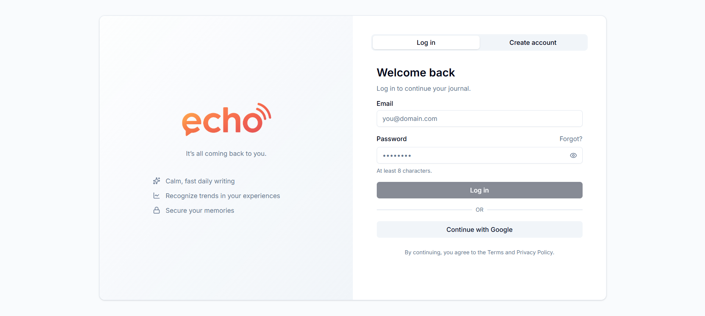
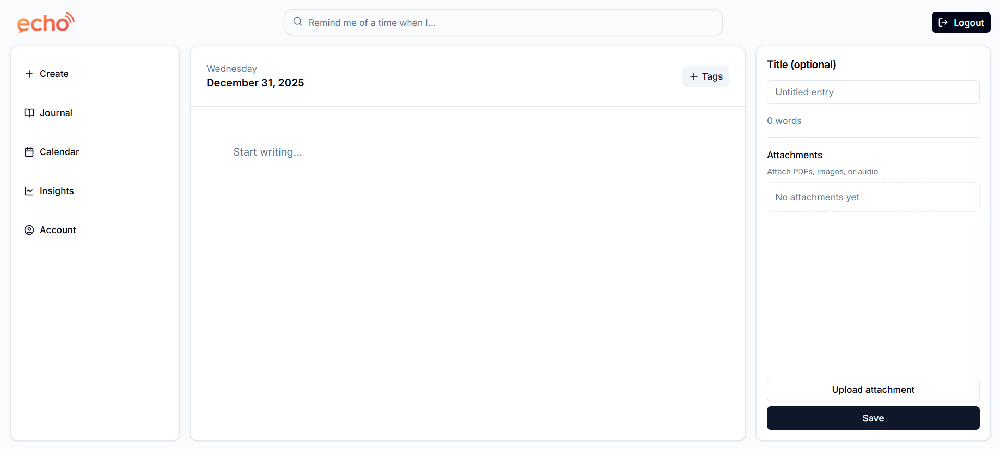
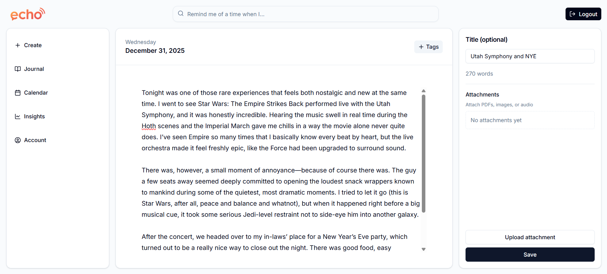
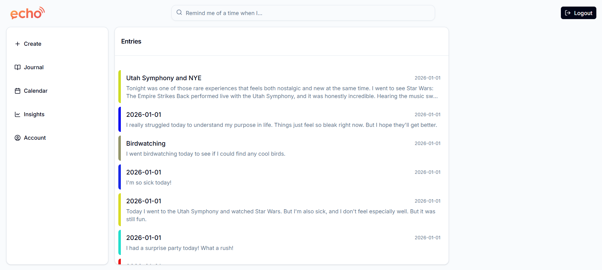
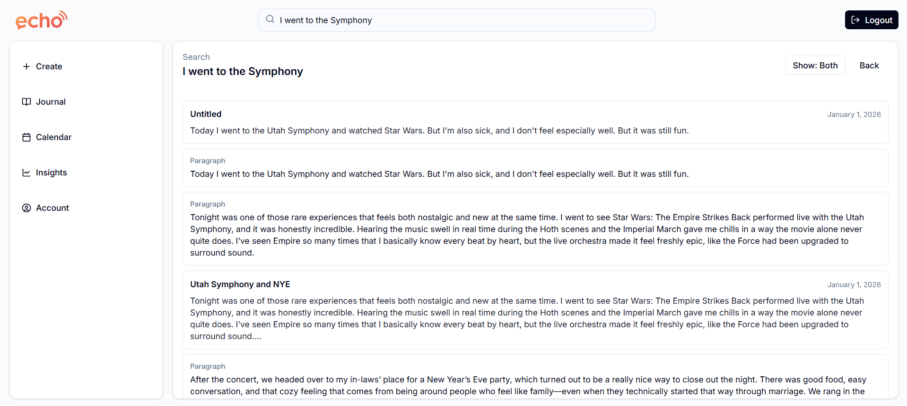
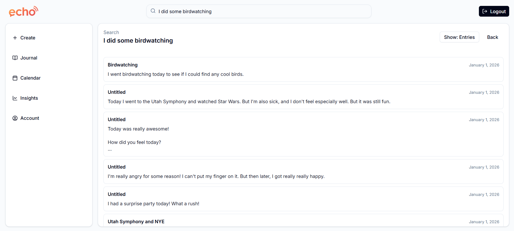

# Report

### Echo

It's all coming back to you.

[View Progress Log](./log.md)

## Summary

For my project, I wanted to explore the exciting possibilities of vector databases and find a fun way to include some machine learning functionality. I created a reflecting journaling application whose express purpose is making experience recall as simple as possible. I wanted a journal that made it easy to use old experiences to inform future decisions.

## Demo

## Diagrams

## Key Learnings

This project was so rewarding, and I learned so much while doing it. Here are just a few highlights.

1. Supabase is SO awesome. I will be using it for all my personal projects from now on. When I started my project, I initially designed Echo to have a hosted backend on an AWS EC2 instance and utilize S3 buckets for attachment storage. But as I learned more about Supabase, I realized that it took care of everything I wanted. My initial backend needs were simple enough that Supabase edge functions were more than enough. I found that Supabase even has buckets, so I didn't end up needing to use S3 either. RLS made everything a breeze, because all my service endpoints could just be moved to client-side database calls. I can't sing Supabase's praises enough.

2. A good initial database schema can make or break the project. I'm really glad that I took the time to really think through my schema from the beginning. By thinking through the entities and their relationships, it made putting together the data access layer so much easier than it could have been. In the end, everything I needed access to was available because I didn't go into the implementation of the system blind. I knew what I needed in my database to make all my features work. By starting with the furthest layer back (the database), it made creating the backend and later the frontend so much easier.

3. When you realize that the initial scope of your project is way more than you have time for, you need to be comfortable with dropping features. And then you iterate in the future, further adding to and improving upon your initial design. I had some pretty lofty goals for my initial desing, many of which were not doable in my 30 hours. For example, the group features, interactive calendar, etc. were not possible to flesh out. My file attaching is still a work-in-progress too. Luckily, I'm really excited about this project and I plan to go back and add more features and improve Echo over time.

## AI Integration and Usage

My project uses AI in a few ways that I think are really cool! First of all, I use the same OpenAI Embeddings API that we used in class to make 1536-dimension vectors for every entry. Each full-text entry has a vector in the database, as well as each paragraph of each entry. This enables my semantic search to work, providing the smart recall functionality that initially inspired my project.

I also use Emotion English DistilRoBERTa-base ([j-hartmann/emotion-english-distilroberta-base](https://huggingface.co/j-hartmann/emotion-english-distilroberta-base)) on HuggingFace for my sentiment analysis purposes. Thanks to j-hartmann for this wonderful model that predicts anger, disgust, fear, joy, neutrality, sadness, and surprise. I used this to map text to an emotion probability distribution. I used this distribution to produce a color corresponding to the particular emotion, which can be seen on the journal page (and which eventually will also color the calendar).

I decided that I wanted to try using AI for one thing that I'm notoriously bad at - making my UI look nice. I am so bad at UI design, and it really makes a lot of potentially cool project ideas so much weaker because of how my UI looks. So I enlisted the help of ChatGPT to help me a bit through TailwindCSS usage to make my UI look nicer. Of course, I wrote most of the code in this project, but I was able to find pretty good success asking ChatGPT for help with my styling. It made things so much easier, asking Chat how I could make my buttons look different, change spacing, etc. I really think I might enlist the help of Chat again in the future for my UI work, because it did a really good job I think.

## Personal Applicability

I think that this project is really interesting, personally, because I have always had a hard time making a journal feel "useful" to me. That's a terrible excuse, I know, but it really has stopped me from keeping a consistent journaling habit. I don't remember to journal, and even when I do, I recognize that I'll likely never read my entries ever again. And that's dangerous! If I don't record my life's experiences, I can never reference them to learn from them in the future.

With Echo, I'm excited by the idea of my experiences being easily retrievable. It's not just powered by a keyword search. It's powered by a sentiment searching, allowing me to search for similar experiences to the ones I'm going through now. I can finally use my past to inform my future. And I have a much better reason to journal now.

## Scaling, Failover, and Authentication

Once again, Supabase makes this a breeze. It offers built-in authentication, row-level security, and managed infrastructure. As usage grows, Supabase can scale reliably. Automatic backups and redundancy reduce the risk of downtime and helps me feel secure in my data. This means that scaling and failover concerns are handled almost entirely by Supabase, leaving me to worry about implementing cool features and helpful functionalities.
