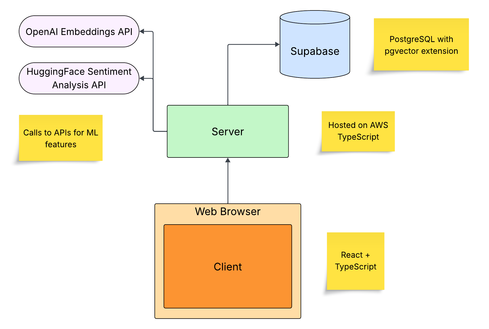

# Initial Design

## Purpose
I've always been bad at journaling. But I've always been even worse at going back to read my past entries. It would be awesome if there was a journaling app that encouraged and actively enabled the user to recall past experiences, especially to help guide future decisions.
 
I'll create a website that allows the user to enter daily journal entries. Upon completion of an entry, vector embeddings are created for each paragraph as well as the entire text of the entry. These vector embeddings are stored in the database for later recall. Users can then search through their previously written entries using a semantic search. Ex. "Remind me of a time when I had to make a hard decision", which then returns the top entries that would be relevant to the user's query. These entries can be entered manually, typed out each day. They can also be scanned in, which is especially useful for those who have many written journals already created. Entries can also be added by voice recording, which will transcribe the entries to text automatically.
 
Entries are also analyzed using sentiment analysis. This allows the user to visualize the positive and negative days of one's life. Additionally, the app could give suggestions to the user about the things/habits/activities/etc. they do or are involved with in the periods when they're the most happy vs. the least happy.
 
Various clusters are automatically created which correspond to different themes. The user can select different themes as filters to view only entries relating to a topic that may be relevant to them. Ex. a cluster of categorized entries might be labeled "temple", which would contain all entries containing some text talking about the user's experiences in the temple, etc.

## System Design
My frontend will be written in React and TypeScript. It will communicate with the backend service hosted on AWS, possibly using EC2. 

The server will handle user requests, such as those to add new entries. When a new entry is added, the server will asynchronously call both the OpenAI Embeddings API and a HuggingFace Sentiment Analysis API. These results will be used to add the new entry to the database on Supabase.

When an entry query is made, the server will once again use the OpenAI Embeddings API to generate the embedding vector fo the user's query. It will then query the Supabase database for the entries or paragraphs with the smallest distance from that of the query. It will then return that data to the client.

## Entity Relationship Diagram

## Rough Timeline Goals
- 11/15 - rough frontend pretty well sketched out
- 11/22 - backend API endpoints created
- 11/29 - OpenAI and HuggingFace logic finished
- 12/6 - finished